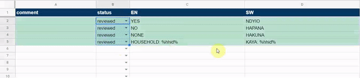

# (PART) Design {-}

# Introduction {-}

work in progress

# Instruments

## Questionnaire

- discourage Don't Know responses. Don't make them very obvious by adding them to all questions. They are a tempting solution for iinterviewers. There are different types of Don't know, often they are related to respondents not makeing an effort to recall something. Intervieers should be encouraged to get respondents to answer. Only add to questions where you accept them. Instead use special codes that are displayed once at eginning of the questionanire and trained to intervieiwers. 

## CAPI/CATI

## Translation

Many questionnaires are designed in one language but fielded in one or more other languages. The way questionnaires are translated affects results, see e.g. @Seo2014. *"Interviewers speak the language and just translate on-the-go."* is a big source of [measurement error][Measurement Error] and interviewer effects, so make sure to **translate your instruments!**

Using CAPI/CATI makes it easy to provide the questionnaire to interviewers in different languages. One can normally switch language within the questionnaire. If managed well, even translating to multiple languages is neither too much effort nor very costly, and a low-hanging fruit to increase survey quality. Translations done badly can quickly spiral out of control, causing tremendous amounts of work and potential mistakes. 

### What should be translated?

Into which languages should I translate?

* Translate into all languages in which a significant proportion of the sample will be interviewed. The size of the proportion depends on the context and available resources, but can be as low as 5%.
* Only translate into languages that can be read fluently by interviewers. Some local languages are spoken only or have no spelling convention, making them very hard to read. 

Do I have to translate the whole questionnaire? 

* Always translate question text, answer options and instructions to the respondents, as they are being read out to the respondent, or help the interviewers record their response. 
* Translate interviewing-facing parts such as interviewer questions, instructions or warning messages if the field teams are more comfortable using a language over the design language. If they are fluent in the design language, there are only marginal benefits.
* Keep questionnaire structure such as names for screens, sections, rosters or the outcome variable in the design language or translate to a common language. Having a common reference makes training, management and feedback easier as everyone is literally on the same page (e.g. *Parcel Listing*).

Add interviewer variables at the end of the instrument to record the main language in which the interview was conducted, if an interpreter was used and what the level of understanding was.

### Who should translate?

There are a few professional firms and translators that specialize in survey translations and cover a range of common languages. For many local languages these are unfortunately not an option. 

A sound translation of survey instruments requires translators to:

* be fluent in the design/source language
* be native speaker in the target language
* have survey field experience (to know survey expressions and ways to phrase questions)
* have good understanding of the subject (e.g. WASH, health, education)
* local contextual knowledge (to know how things are referred to locally)

This set of skills and experience is rarely combined in one person. Translations from professional translators can sound too formal or bulky, while translations from field staff might miss the essence of a question or a construct. In the absence of professional survey translation services, the best options are often local consultants or experienced field workers who have worked with similar types of surveys before. 

Ideally, translation is done by a group that combines the above listed experiences and receives input where they lack, e.g. to correctly translate main toilet types or drinking water sources. It is useful for questionnaire designers to work through the instruments with the translators to make sure complex or nuanced parts and constructs are understood. A common communication channel (e.g. Email to all, WhatsApp group,...) for translators to ask questions and for designers to send clarifications to all translators is important to ensure consistent translations into multiple target languages.  

### Some translation guidelines

Follow below guidelines when translating survey questionnaires. Share this list with the translation team.

* Preserve meaning. Literal or close translations are often inadequate, especially if the target and source language and culture are distant. Find the best way to express the same meaning in the target language.  

* Be precise. Use expressions to describe a construct if there is no word for it in the target language. E.g. use *"those who live with you"* instead of "*family*" if there is no word for *"household"*

* Don't omit words that provide any type of reference, such as *"on average"*,*"in total"*, *"main"*.

* Keep it simple. Use language and expressions that are easy to understand for all respondents in the sample. 

* Make sure the same parts of questions are stressed. E.g. in English, the reference period is put at the beginning of a sentence to highlight it. In other languages this might be elsewhere.

* Adjust to different customs and culture. Direct translations might sound overly positive, negative, polite, impolite, etc. E.g. you might have to drop or add the word *"please"*. 

* Be consistent within and across instruments. Use the same words or expressions to translate one concept in the source language. Check consistency by searching for key expressions in the translation sheet (e.g. `Ctrl+f household`) and checking they have been translated the same. 

* Use established (good) surveys as references. They have already been tested and fielded in your context and often are a useful source of nomenclature.

* Preserve formatting, it carries meaning. Whatever is __bold__, <u>underlined</u> or UPPERCASE in the source language should be the same in the target languages.  

* Preserve code. CAPI/CATI text sometimes contains dynamic parts that are written in code and must not be translated, e.g. piped text in Survey Solutions `%MEMBER%` or `<html>` tags. Use the custom Stata command [sursol transcheck](https://github.com/petbrueck/sursol) to make sure all Survey Solution formatting and code is correct in the target languages.

* Stay local. More widely spoken languages such as Spanish or Arabic can differ significantly between countries in how they call or express certain things. Use local translators, and review and adapt if using (parts of) questionnaires from other countries.

* Use the CAPI/CATI or a paper questionnaire in the source language on the side as guidance. Translations will depend on the context that is often not given when working in translation sheets.

* Give feedback if you think the source language needs updating and get clarifications if you are not sure how to interpret something.  

For more practical translation guidelines, see [Chapter 12](https://www.europeansocialsurvey.org/docs/round9/methods/ESS9_translation_guidelines.pdf) of the ESS Translation Guidelines [@EuropeanSocialSurvey2018].

### Translation verification

Verify translations of your instrument. Despite being much-cited and persistently being added to ToRs, *back-translations* are not a great means to verify translations. Most big organizations such as the @EuropeanSocialSurvey2018 or the
US Census Bureau [@Pan] that run multilingual surveys and put a lot of effort into comparative survey design use and recommend the TRAPD method (**T**ranslation, **R**eview, **A**djudication, **P**retesting and **D**ocumentation). 

It involves reviewing and comparing (at least) two independent draft translations and agreeing on one translation that is cognitively pre-tested. Insights from the pre-test feed back to the translation, and the whole process is documented. Translation, review and adjudication are normally done together by a team that combines translators, survey field experts and content subject experts. A team-based approach deals better with mistakes, idiosyncratic interpretations and translator blind spots, compared to individual translators working on their own. 

Surveys with tight budgets and time constraints can use a reduced version of TRAPD to verify translation. Save yourself the back translation. Instead, use independent translator(s) to systematically review all rows in your translation sheet. The reviewer(s) either approve a translation or suggest an alternative translation in a new column. Translators and reviewers discuss all discrepancies and choose a final translation. Using a translation management system as described further below, translation and review processes can overlap and do not necessarily add much time to survey preparations. 

Make sure to desk test your translation in the CAPI/CATI before the pre-test. Often, the context, the way questions are displayed in the interface or the sequence require translations to be updated.

As a last defense, verify the translation during the training. During the questionnaire review part, project the questionnaire and read out loud each question in the design/common language. Trainees follow on their devices in the local languages they are fluent in and are likely to use in the field. For each question stress the meaning of the question and check with the trainees if the translation is accurate.  Assign one person to make updates to the translation sheet on the go based on feedback from the trainees. Keep note of contentious items and address them with selected trainees on the side or after the session in order to not delay the training.

### When to translate

Translate a questionnaire too early, and juggling the inevitable many updates can quickly overtake your work and introduce mistakes. Translate too late and the instruments are not verified, poorly translated or simply not ready in the local languages at the time of the pre-test, destroying one of its main purposes.

In the preparation phase, carve out enough time prior to the pre-test for translation and verification. Try to complete the questionnaire before that, so that it only undergoes minimal change once translations have started. Translating a normal socio-economic questionnaire can take several days, and so does the verification process. 

If there is little time, you can use a staggered approach to provide enough time for translation. Translators can already translate and verify completed sections while the remaining sections are being finalized or put into CAPI/CATI. Use a translation management system as described below to stay on top of the updates and avoid mistakes. 

If you are using a paper version to develop the questionnaire, do **not** directly translate the paper version, but wait for the electronic questionnaire to be developed. When building the CAPI/CATI tool, questions often have to be modified to function in the interface, especially around roster and dynamic question text. If already translated, these changes have to be made in many versions, and often in languages the questionnaire designer does not speak, making updates difficult and error prone (e.g. when trying to find the word NAME in local languages to replace it with dynamic text). It is a lot easier, faster and less error prone to translate and manage updates once the tool has been converted to CAPI/CATI. 

If you require translated paper versions e.g. for training or archiving purposes, create them **using</u>** your translated CAPI instrument. Often this can happen during or after field work, once the questionnaire does not change any longer, and during less work-intense parts of the project. 

### Stay on top of updates

Let's face it. Most questionnaires will still undergo some change after the translation process has started. Done wrongly, late updates to the questionnaire can easily turn into a managing nightmare and cause significant undetected differences between the source and target languages. Done correctly, one can relatively easily stay on top of questionnaire modifications, even if there are a considerable amount of change and several target languages. 

Do **not**:

* Do **not** translate in the CAPI/CATI tool directly. They tend to hold only one additional text field for each language and have no means to let you manage or document the translation and verification process. 

* Do **not** translate or store translations directly in translation sheets exported from CAPI/CATI, as they will be outdated with the next update to the questionnaires. You will inevitably end up trying to juggle different parts of the questionnaires on different translations spreadsheets for different languages.

*  Do **not** work with offline versions of translation sheets sent back and forth by email. As above, this quickly becomes unmanageable. 

Instead:

* Work with an online spreadsheet such as Excel or Google sheets that holds all the translations and allows questionnaire designers and translators to simultaneously collaborate on the same live document. 

* Define clear processes, how questionnaire designers mark rows that need to be translated, reviewed or updated, and how translators record the translation status of each row. Make sure designers and translators follow the processes to make the system work. Examples are:

    * Add columns `status` (fixed set of answers, e.g. *"to translate", "to review", "to update", "translated", "reviewed", "don't translate"*) and `comments`. Designers change the column `status` for rows they added or updated in the source language and provide details in `comments` if necessary. The first translator modifies the target language and sets `status` to *"translated"*, the reviewer to *"reviewed"*. At the end of the process, all rows should be in the final status *"reviewed"*.  
    
    * Designers add a special symbol that does not occur in the questionnaire or code (e.g. "@") to the beginning of the target language column for rows that need to be translated, updated, or reviewed.  Translators remove the symbol after updating the target text. 

* Use conditional colour coding to highlight rows of certain status, and [filtered views](https://blog.sheetgo.com/google-sheets-features/filter-google-sheets-without-affecting-other-users/) to generate custom views, e.g. a view for translators containing all rows they need to work on. 

* If you are working with Survey Solutions, use the [translate_questionnaires](https://github.com/andreaskutka/translate_questionnaires) STATA tool to keep your translation sheet in sync with the questionnaires and to produce the translation templates to be uploaded to the Survey Solutions Designer. The tool can be adapted relatively easily to work with other CAPI/CATI packages that export and import tabular translation sheets.

* For CAPI/CATI software such as ODK or Kobo that use spreadsheets to build the instruments, one can integrate the translation process into the same spreadsheet used to build the instrument by adding additional columns. Use an online spreadsheet to allow simultaneous access to designers and translators, and define processes as described above.  

### On-the-fly translation

As described above, translate into as many languages as possible and try to avoid on-the-fly translations as much as possible. Sometimes however, on-the-fly translations are inevitable, e.g. if local languages cover small parts of the sample population or are non-scripted. If this is the case, make sure that interviewers have practiced translating the questionnaire in front of others prior to the field, and that there has been a group consensus on how to translate the questionnaire into the local languages. Both significantly improve the quality of the translations and can be implemented using group practice during the training.  

For group practices, group together trainees according to the local languages they are likely to use in the field. One trainee playing interviewer administers a question in the local language, those playing respondents follow on their tablets in the source language and make corrections or suggestions on how to improve the translation. Trainees should rotate roles such that every trainee has practiced translating the entire questionnaire to others speaking the same language.

If you will have to work with local interpreters to translate interviews on-the-fly, make sure that interviewers explain well the key concepts such as "household" or "parcel", and that they are understood by the translator. Make sure that you have budgeted for local interpreters if they are likely to be needed.

# Sample

work in progress

# Manual

work in progress

# Pilot 

some words
