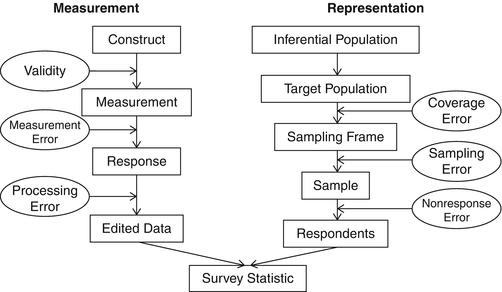

# Total Survey Error {#tse}

In the survey context *error* refers to the deviation of a survey response from its underlying true value. Probably the best-known error type is *sampling error* that occurs when collecting information from a sample of the population rather than the full population. Early in the history of probability sample surveys, it was recognized that there is a variety of non-sampling error sources that can equally cause a survey statistic, often referred to as *survey estimator*, to deviate from its underlying true value in the population, referred to as *population parameter*. Over time, this knowledge evolved into the concept of *Total Survey Error* (TSE), which has become the dominant paradigm in the field of survey methodology @Groves2010. 

TSE acknowledges that error can arise from many different sources. For example, error might be introduced by researchers formulating questions wrongly, interviewers not probing sufficiently or respondents unwilling to respond. Error may occur at any point in the survey process, including the design, sampling, implementation, processing or analysis, and may be caused by any actor including researchers, interviewers or respondents. TSE denotes the aggregate of all error sources in an estimate and is thus the difference between a survey statistic and the population parameter. A good presentation of how TSE components link to the process of generating a survey statistic has been made by @Groves2004, which is shown in Figure \@ref(fig:tse-comp).

```{r tse-comp, fig.align = 'center', fig.cap="TSE Components Linked to Steps in the Measurement and Representational Inference Process", echo = FALSE, warning = FALSE, comment = FALSE, message = FALSE}

```

## Error sources 

The TSE framework decomposes survey error into different error sources. Survey methodologists have produced a number of similar classifications. They divide TSE into *sampling error* and *non-sampling error*, that in turn can be further decomposed. We follow the classification developed by @Biemer2003. We briefly introduce each error source and provide real-world examples that we have observed in our work with NSOs, international organisations and survey firms.

### Sampling error 

*Sampling error* describes the error that occurs if a sample of the population is surveyed, instead of surveying the entire population, i.e. conducting a census. It is determined by the sampling scheme (simple, multi-stage, stratified, ...), the sample size and the choice of estimator. If probability sampling is being used, the sample error is randomly distributed and can be mathematically computated. It is probably for that reason that sampling error is receiving a disproportionate high level of attention by researchers and survey designers. 

By definition, sampling error occurs in every sample survey. Sampling error becomes problematic if it is unnecessarily large due to faulty or inefficient sampling design or is minimized at too high expenses of other error sources. If non-probability sampling methods are being used, sampling error may also introduce bias. Examples include:

- The so-called *"Random walk"* is an oxymoron. Interviewers can easily tweak the sequence in which they list units, so that respondents are selected that meet certain characteristics, such as being available for an interview or being friendly. Random walk is a not a probability sampling method and introduces bias. Unfortunately, some surveys still use it for a fast and cheap second-stage sampling.

- A HIES used *"convenience sampling"* to select individuals within collective living quarters as respondents were unable to list all individuals living there. Interviewers selected whoever was available during their visit, effectively removing individuals from the sample that were unavailable during working hours, thus introducing bias. A probability sample method could have been used instead, for example, by listing all lockers or beds or other items associated with individuals, randomly selecting items from the list and putting effort into interviewing the associated individuals.

- A survey part of an impact evaluation study selected a varying number of households per community, depending on the community size. In the largest communities, up to 40 households were interviewed. While this sample design does not increase sampling error nor introduces bias, it is inefficient. Beyond 20, the marginal decrease of sampling error per additional household per community is negligible. The resources spent to interview them could have been used to decrease error from other sources instead, for example by extending training or increase monitoring. 

### Specification error

*Specification error* (referred to as *Validity* in Figure \@ref(fig:tse-comp) occurs when there is a misalignment between the concept a survey intends to measure and the concept that is actually being measured. As a consequence, the wrong parameter could be estimated by the survey and invalid inferences be made. It is often caused by insufficient definition of concepts, poor questionnaire design, lack of cognitive testing, absence of good manuals, or concepts not being preserved during questionnaire translation or CAPI scripting. Examples of specification error are:

- Surveys that aim to capture income from any kind of employment sometimes ask opening questions like *'In the past ...,  did NAME work as an employee for a wage, salary, commission, or any payment in kind?'*. Designers and data users assume that this question captures informal jobs. Often however, respondents understand this question to  ask about formal employment only and answer with *'No'*, even though they have worked as day laborers for a few days. The question does not capture the concept of employment as planned by designers or interpreted by analysts. 

- Researchers or questionnaire designers developing questions without taking into consideration local circumstances or testing that underlying concepts are understood the same way in the population. For example, questions around saving behavior tend to be delicate and highly dependent on economic circumstances.

- Researchers assuming that *goods bought on credit* are included in a loan roster, while the questionnaire did not explicitly probe for them and trainers did not train interviewers to include them. 

- Mistakes that happen when updating translations or instruments. last-minute change is made to the questionnaire during the training,  in the local language that never finds its way into the original version in the design language which is being used as data reference. Data users will interpret the question differently to how it was being asked.

- *Household* to be translated as *family* in the local language, referring to a different set of people. Household refers to the economic unit and does not necessarily imply family ties. Many languages lack a word for household. An expression like *those living with you* would often be more appropriate.    

- Sometimes, CAPI scripting can alter the nature and functionality of questions or modules to such a degree that it affects the way they are being administered and ultimately changes results. Researchers who do not observe the CAPI questionnaire being fielded remain unaware of such differences. For example, time use modules are often designed as a grid of activities and hours of the days into which lines are drawn for the primary activity done for a certain period. We have seen this module being scripted in CAPI as series of 48 questions asking the respondent for the main activity for each 30-minute interval. The responses produced are not at all comparable.  

- DHS and *"Is it OK to beat your wife question"* NOTE: ARTHUR TO WRITE 

- Different household definitions, different results?

### Coverage error
*Coverage error* or sometimes *frame error* occurs if the sampling frames that are used to select the survey sample include units that are not part of the target population, exclude units that are part of the population or duplicate them an unknown number of times. It also refers to errors in auxiliary variables associated with the frame units, or if they are missing. Frame error can cause parts of the population to be under- or over-covered, distorting the sample or impact evaluation design.  

Since building perfect frames is often practically not possible, most surveys suffer from frame error to some degree. More severe cases of frame error often stem from a lack of quality assurance of listing exercises, the use of unverified lists compiled by third parties, or the use of outdated lists. Examples are:

- During listing exercises listers sometimes focus on the population-dense village centers, as it is quick and easy to list a large number of households, but omit households that live further away or are difficult to reach. As a result, remote households are under-covered in the frame. 

-  Community lists are usually being used as frame for first-stage sampling in household surveys or to inform impact evaluation design. In some contexts, these lists can be of very poor quality. We have experienced field teams searching for non-existent communities or that community characteristics grossly mistmatch the auxiliary variables used for sampling or matching.

- A survey for an impact evaluation in Perú used household lists for the second stage sampling in treatment areas that had been compiled by the project to be evaluated. Several local dynamics played into the creation of the lists. As a result, in many villages, several members of one household were listed as separate households on the list, friends and family of project officials from outside the village were included, or beneficiaries from the village excluded.

### Nonresponse error

Nonresponse error can occur on the _unit_ level, when a sampled survey unit (e.g. household, individual, firm, etc.) cannot be interviewed for any reason, or on the _item_ level, when parts of the questionnaire remain unanswered because the respondent did not answer some questions for any reason. Nonresponse error can severely affect the validity of survey data. Since the reasons for nonresponse are hardly ever randomly distributed, the actual respondents may no longer be representative of the population, causing the survey estimates to be biased.   

Nonresponse error has been plaguing survey methodologists in the global North, where nonresponse levels generally have been very high over the past decades   Surveys in the global South have so far largely been spoiled with very high response rates, but nonresponse error is increasingly becoming an issue, especially in urban areas, where availability and willingness to participate in surveys is decreasing. While various approaches have been developed that aim to correct for nonresponse error, the best way to deal with it is to put solid measures in place to avoid it as much as possible. QUOTESNEEDED.

Examples of nonresponse error are:

- Survey teams visiting communities during working/market hours and replacing unavailable households without making sufficient revisiting attempts on different days and hours. 

- In a survey in urban South Africa, many interviewers were scared of dogs and replaced households if they owned a dog. Dog ownership was (initially) not observed and highly correlated with other household characteristics.  

- The below average probability of Donald Trump supporters to respond to interview requests is [thought to be](https://edition.cnn.com/2021/05/13/politics/2020-polling-error-research/index.html) the main reason that surveys systematically underestimated the support for Donald Trump ahead of the 2020 US presidential elections.

- In a COVID response phone survey, interviewers were unable to call those panel respondents who had not paid their phone bills and had their line (temporarily) cut off. 

- Long questionnaires that cause respondent fatigue and lead to high rates of uncomplete interviews, affecting the last sections of the questionnaire.

- High _Don't Know (DK)_ rate for income related question if interviewers do not probe and explain the question sufficiently. 

- Respondents refusing to participate in the survey. This is happening increasingly often in some context, such as urban areas. Interviewers can be trained in best practices to convince respondents to participate.  

### Measurement error

*Measurement error* often is one of the most damaging error sources in a survey. It occurs if the recorded value is an inaccurate measure of what was to be measured. They can be due to the interviewer, the respondent, the questionnaire, protocols or their interaction. They might be intentional or unintentional. Respondents might misinterpret a question, struggle to recall some information or deliberately give a wrong response. Interviewers might administer a question incorrectly, misunderstand questions or answer option, record typos, falsify responses or cause measurement error in many other ways. Poorly designed questionnaires, ambiguous questions, underdefined concepts often are big contributing factors to measurement error, as can be the interviewing mode.

- Some interviewers in an LSMS survey confused KG and Gram and selected the wrong answer option in the consumption unit. As a result, the food quantities they recorded were off by a factor of 1000. 

- Respondents who purposefully under-report household members, crops, livestock or other items, knowing that each item they report will entail a long set of follow-up questions. 

- Interviewers recording responses against the wrong questions or for wrong items due to confusing CAPI design that fails to provide them with a good overview of the questionnaire.

- A school survey conducted teacher interviews and recorded teacher attendance in classroom. Reason for absence was not recorded and no protocol was put in place to ensure both exercise were conducted during different hours. In a follow-up survey that corrected for both problems, 8% of the teachers were absent from classroom for being interviewed at the time.

- Agricultural surveys trying to capture very detailed information on the parcel-crop-season level can be too detailed for respondents to recall, or for interviewer and respondents to get lost in the conversation. 


### Processing error

Processing error refers to any error occurring post-interview including error in data entry, editing, formatting and labeling, construction of indicators, calculation of survey weights, or tabulation of results. It is often caused by unclear interview rejection mechanisms, data editors who are not qualified enough, improper keeping of records or change logs. Examples of processing error we have observed are:

- Interviewers "fixing" issues in rejected interview files without recontacting the respondent or obtaining the correct answer.

- Wrong or non-systematic outlier detection, such as manually summarizing variables in statistical software and looking at the 5 highest and lowest values only.

- A NSO replaced the outlier values in any variable with its median value prior to data publication.

- Not correcting for changes to the instrument when appending the data from different versions. For example, f there has been a change to answer options or item lists, this can cause value labels to be assigned wrongly for parts of the sample.

- Wrongly label value codes, such as household assets.   

<!-- Smith (2009), who extends the total survey error paradigm to also include international surveys whose main purpose is to compare countries. Among other things he therefore adds the source ‘‘comparison error.’’ He also adds the ‘‘conditioning error’’ that is unique for multi-wave panel studies. -->

## Survey-related Effects  {#surveyeffects}

Conducting a survey in the way it is being conducted, in its context, has itself effects on survey statistics. While these effects are often implicitly included in TSE and referred to as error, @Weisberg2005 uses the term *survey-related effects* and explicitly includes them into the framework. Examples of survey-related effects are:

- **Interviewer effect**:  Interviewer characteristics such as mannerism, tone of voice, gender, ethnicity, etc. have shown to influence the type of response they elicit. This effect on survey statistics is not due to any mistakes or wrongdoing by the interviewers, and will exist for any survey using interviewers.

- **Mode effect**: Administering a question in face-to-face interviews can produce very different response patterns compared to asking the same question in telephone interviews or  self-administered interviews. This, for example, can be due to respondents attitudes being different if they receive an interviewer at home (guest) to being called by phone (solicitor/marketer). In multi-mode surveys or with modality changing between rounds, mode effect can cause significant comparability issues. 
<!--  (Beland and St- Pierre 2008) have shown that respondent state lower body weight in CATI compared to self-administered modes. -->

- **Questionnaire-related effects**: Answers patterns can differ with the exact question phrasing. As long as there is no specification error, there is no question phrasing that is more "correct" than others. Similarly, the order in which questions are asked can change outcomes. Yet, they have to be aske in some order. The same is true for the phrasing and order of answer options. A well established example is the *recency effect* in phone surveys, where respondents select the last answer option because they remember it best. 

While some of the survey-related effects can be minimized, e.g. through randomization of question or answer option order or careful field team planning, they cannot ever be eliminated completely as they are an inevitable product of a survey itself. For example, since a survey requires interviews to be conducted somehow, mode effect will always exist in a survey. In some cases, it is possible to study and quantify effects in experimental design and to make ex-post adjustments. This, however is costly and requires provisions in the survey design. In practice, usually the best way to deal with survey-related effects is to be aware of them and keep them in mind during survey design and analysis.


## The Impact of Error  {#impacterror}

Sample surveys aggregate individual responses to obtain statistics for the sample, referred to as *survey estimator*, often with the aim to infer corresponding values in the population, referred to as *population parameters*. Survey error causes the survey estimate to deviate from the population parameter, diminishing the *accuracy* of the inferences derived from the survey data. In other words, with high levels of error a survey does not accurately describe the reality of the population.   

Error can affect survey estimators by **increasing the variance** of a variable or by **introducing bias**. For a survey estimator to be accurate it has to have a small bias and variance, which only happens if the [TSE](#tse) is low for the estimate. The ways in which error affects an estimate depend on whether the error is *random* or *systematic*, and whether it is *uncorrelated* or *correlated*.

Error is considered *random* if it does not follow any pattern. For example, if respondents have difficulty recalling an item, some respondents might give higher values while others provide lower values. Across all observations, the error would have a mean of zero and would not affect the mean value of the variable. However, random error increases the variance of a variable, which in turn **reduces the reliability** of a survey estimator. The higher the variance, the higher the probability that the estimator would be different if the survey were to be repeated under the exact same conditions. The results would be less reliable. Increased variance furthermore reduces the magnitude of correlations with other variables and the statistical power in hypothesis tests. 

If error contains a *systematic* tendency we speak of *systematic* error or *bias*. As an example, if interviewers tend to under-report household members to shorten interview duration, the survey estimate of household size will underestimate the actual household size in the population. In statistical terms, the sample mean would be a negatively biased estimator of the population mean. Since systematic error directly affects the mean of a variable, it **reduces the validity** of the estimator, in other words the estimator is not accurately measuring what it is supposed to. If the systematic error is not constant, it may furthermore increase the variance of the variable, also reducing the reliability of the estimator.

Figure \@ref(fig:val-rel) illustrates how variance and bias relate to the reliability and validity of a survey estimator. Imagine the midpoint of each image to represent the true population value and the black points to be the recorded responses. The points in A are scattered around the midpoint with no particular pattern, the error is random. We have high variance but no bias. The estimator is valid but not reliable. In B, the answers are offset in the same direction and by the same distance. The error is systematic, so there is bias, but variance is small. The estimator is reliable, but not valid. C shows systematic error that is not constant. We have high variance and bias. The estimator is neither valid nor reliable. In D, there is little error, we have low variance as answers are relatively close to the actual value, and there is no bias as the deviations show no pattern. The estimate is valid and reliable.

```{r val-rel, fig.show='hold', fig.cap="Reliability and validity in survey estimators", echo = FALSE, warning = FALSE, comment = FALSE, message = FALSE}
knitr::include_graphics("images/reliability_validity.svg")
```
The magnitude of the effect of error depends on whether the error is *uncorrelated* or *correlated*. Error is *uncorrelated* if the error for different units (e.g. households) is unrelated. An example would be occasionally typos by interviewer when recording answers, if typos do not occur more frequently with certain types of households or some interviewers. Above discussion on the effects of random and systematic error was based on uncorrelated error. As we saw, the increased variance and bias can have serious effects on statistics.  

If the error for different units is related, we speak of *correlated* error. For example, interviews conducted by one interviewer who has misunderstood a question and administered it wrongly will contain the same error, while those of another interviewer may not. Correlated error has much more damaging effects on estimators as it multiplies the variance of a variable. @Biemer2003 show that only a moderate intra-interviewer correlation of $\rho_{int} = 0.03$, can result in an interviewer design effect $\mathit{deff_{int}}$ as large as 2.47. In other words, the intra-interviewer correlated error alone can cause the variance of a variable to be increased by 1.5 times. 

Error is typically also correlated for other survey roles, such as supervisors, data monitors or editors. One data monitor, for example, might thoroughly review interviews and provide useful feedback , reducing mistakes and measurement in their field teams while another data monitor only glancing over interviews will miss many of the issues and fail to reduce measurement error.  


## Minimizing TSE {#minimizing-tse}

The TSE framework implies that the TSE affecting a survey estimate should be minimized in order to maximize its accuracy. Two points are important to note here. 

First, the *total survey error* needs to be minimized, that is the *aggregate* of all error sources. Errors from different sources do not occur in isolation, but are interdependent as they are all part of the overall survey process. Minimizing error from one source may negatively affect error from other sources. As an example, while increasing the sample size will reduce sampling error, it may not be a good overall strategy to increase the precision of a survey estimator. A larger sample can require more interviewers to be trained and monitored, increasing other non-sampling error types that can outweigh the gains from reduced sampling error. Another example can be complex parts of a questionnaire, such as a time-use module, that have been optimized for PAPI, but may cause significant error if implemented in CAPI without being carefully adapted to the functionality of the CAPI package being used. 

Understanding how decisions in one phase affect error in another requires a comprehensive view of the entire survey process. In order to effectively minimize TSE, different survey phases and components have to be integrated to operate as as a coherent whole.

The second point to note is that TSE is to be *minimized*, meaning to be reduced as much as possible *within survey constraints*.  All surveys face constraints such as the available budget, time and human resources or ethical considerations. Attempting to eliminate all error would exceed the constraints of any survey. Even with unlimited resources, some error sources could never be eliminated fully, such as respondents unwillingness to disclose some information causing item non-response. Instead, surveys should strive to avoid the most damaging errors and control others to the extent that they are mostly inconsequential and tolerable. 

How can survey practitioners prioritize which errors to address? A key challenge is that it is very hard to quantify survey error or its non-sampling components. This is only possible if the underlying true population value is known or if methodological experiments can be built into the survey design, which is an option for most surveys. In practice, minimizing TSE requires a detailed understanding of the main causes of survey error, their relative impact on accuracy, means to control them and the required effort. This knowledge is often anecdotal and based on experience in survey implementing institutions or individuals who have honed their error awareness, identification and correction over time. While there are some scientific publications on this topic, they tend to be theoretical or isolate and a address a single error source. Survey practitioners involved in the day-to-day implementation tend to not publish their practices. 


<!-- Fortunately, detailed knowledge on costs, errors, and methodological effects -->
<!-- of design alternatives are not needed for every survey design for two reasons: (a) design robustness; and (b) effect generalizability. Design robustness refers to the idea that the total MSE of an estimator may not change appreciably as the survey design features change. In other words, the point at which the MSE is minimized is said to be ‘‘flat’’ over a fairly substantial range of designs. For example, it is well known that the optimum allocation of the sample to thevarious sampling stages in multistage sampling is fairly robust to suboptimal choices (see, for example, Cochran 1977). Effect generalizability refers to the idea that design features found to be op- -->
<!-- timal for one survey are often generalizable to other similar surveys; for exam- ple, similar topics, target population, data-collection modes, and survey conditions. A -->

<!-- Design decisions and require an understadning and  -->

<!-- the TSE still is a useful framework to conceptualize error, identify the biggest sources and inform design decisions.  -->
<!-- isolate specific error sources and identify means the reduce or eliminate them. -->


<!-- - sometimes might have costs, e.g. might need to pay for role of central data monitors or checking exercises -->

<!-- break down nonresponse into non-contact, refusal, unavailability, identify iggets source and do soemthing abbout them.  -->

<!-- In addition to these typologies serving as checklists of possible errors and their estimation, it is important to find ways to eliminate their root causes. -->

<!-- adhoc as things unfold, iterative,  -->

<!-- soem require shifting or allocation of resources. For example, in a survey that expects non-contact to be problematic, one might slightly reduce the sample size by reducing the number of households per community to provide teams with more time to revisit unavailable households.  -->

<!-- For example, in survey it might pay off to extend the interviewer training by a few days to to reduce measurement error, and "pay" for the extension by slightly reducing the sample size and accepting a little larger sampling error.   -->

<!-- In many instances, this does not require any additional costs or resources, but rather requires following of some protocols and implementing best practices. For example, implementing a good training that prepares interviewers well for fieldwork and reduces measurement error is not more expensive than implementing a mediocre training in which interviewers do not learn much and measurement error will be high. Likewise, following the translation guidelines will result in better quality translation, reducing specification and measurement error, while not costing more effort or even less compared to a badly managed translation process.  -->

<!-- Sometimes our guidelines also show you how to implement certain stages efficiently so that resources free up that you can use to improve quality.  -->

<!-- The survey should be designed and each stage implemented such that the total survey error is minimized.  -->

<!-- In some instances, it might be necessary to relax some of the survey constraints to achieve sufficient quality, such as getting budget or timeline extensions. Another example may be that a questionnaire might have to be reduced to ensure the core data needs are met, but not allowing some of the anticipated secondary data uses.  -->

<!-- Similarly, to afford the nonresponse follow-up activities required for reducing nonresponse bias, a reduction may be taken in the survey pretesting phase or in the length of the interview.  -->

<!-- optimal design attempts to minimize TSE  -->

<!-- Design each component of survey to minimize error inherent to -->
<!-- that component -->
<!-- – For example, design shorter questions for telephone than personal -->
<!-- interviews to reduce measurement error -->
<!-- • Assess level of error associated with alternative procedures and -->
<!-- choose combination of approaches best suited to problem -->

<!-- good framework to isolate different error types  -->

<!-- decompose non-response into non-contact and refusals.  -->

<!-- understand the root causes of error. For example, substantial observation of interviewers, review of audio recording, and investigation of para data can shed some light on what the main drivers of measurement error are in the context, such as interviewer comprehension, respondents unwillingness to disclose information, typos, falsification, etc.   to understand one might have to decompose measurement error further and understand what  -->

<!-- A good check lists for survey design, to early identify. potential big issues. For example, by going through the list of error sources, one might put more effort into reviewing the comprehensiveness and integrity of the sampling frames and discover potential issues early, so they can be addressed or designed around. Review the potential error sources,  -->


