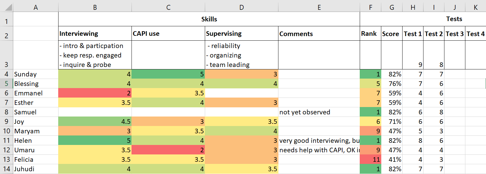

# Assess & select fieldworkers {#assess-select}

A competitive competency-based fieldworker selection is critical to achieve quality in surveys. It is therefore highly recommended to train an [excess of fieldworkers](#trainingsize), to continuously assess trainee performance throughout the training and to select interviewers, supervisors and other fieldwork roles from the pool of trainees at the end of the training, based on their capacity. The selection should be informed by their understanding of the survey content as evaluated in written tests, by other relevant skills and characteristics observed during the training, or in some cases by standardization tests. This chapter provides a step-by-step guide on how to evaluate trainees and select fieldworkers. 

Assessment and selection of fieldworkers during the training serves several important functions:

1. __Improve overall fieldworker capacity__. Most importantly, selecting fieldworkers based on their ability to perform well in their role ensures a high level of capability among fieldworkers. Other selection criteria, such as experience or time with the organization often are insufficient or even counterproductive in identifying capable field staff, as experienced fieldworkers might have to "unlearn" undesired habits from other surveys, pay less attention during the training or have a developed a sense of entitlement. Continuously assessing trainees during the training provides a solid picture of their capacity to work on this specific survey. 

1. __Increased attention during training__. With tests from the first day and knowing about the competitive, merit-based selection, trainees understand that it matters to pay attention, participate and learn material independently. This is especially true for experienced staff who otherwise often don't pay full attention as they know that they will be hired anyway.  Regular tests make it clear to trainees what they do not know. Knowing their relative score during the training also motivates low performers to increase their efforts. Higher attention and participation translate into higher learning outcomes and better performance.

1. __Tailored feedback/training__. Test results reveal early areas of the content that are poorly understood and need more attention in the training. Reviewing and debriefing written tests often also provides valuable insights on where misunderstandings stem from or why mistakes are made. Trainers can tailor the training and feedback to address the issues, improving the overall level of understanding. 

1. __Verification of methodology__. Writing and debriefing tests often reveals unidentified gaps in the questionnaire design, such as underdefined concepts or conflicting definitions, and checks if explanations in the manual are useful or not. It is a great way to check if interviewers' understanding is aligned with questionnaire design. 

1. __Fieldworkers do better__. As humans, we simply do better at work if we know that it matters. The tests and selection help to convey the idea to fieldworkers that it is really important for them to do their job well. 

1. __Builds a reserve of replacement fieldworkers__. Trainees who did not get selected (but were good enough) can replace fieldworkers that drop out during fieldwork. Since they have undergone the full training, they can be brought up to speed relatively quickly with a refresher training, some practicing and strong supervision during the first few days.

For many surveys, fieldworkers are selected by the organization or firm implementing the survey that might follow their own procedures. In those instances, be cautious as the selection criteria and processes might not result in optimal outcomes. Try to exert some control over the selection process, e.g., by explicitly spelling out in the ToR the necessity to train an excess of trainees and select fieldworkers based on capability in a transparent and objective process, that you can back check.

## Written tests

Regular written tests play an important part in the evaluation of trainee performance. They are a very useful means to systemically test trainees' understanding of questionnaire content and training material and to identify general areas of weakness that require to be reinforced during the training.  

__Conduct written tests on a regular basis__ throughout the training, e.g., daily or every other day, whenever new theoretical content has been covered or debriefs have been held. For written tests to be able to fulfill their above-described functions, it is also crucial that they are conducted from the very beginning of the training. Do not leave written tests to the end of the training, as it is usually already too late to adjust the training schedule, alert low performers to increase their efforts or retrain content that is generally poorly understood.  

### Designing tests 

Written tests should probe the understanding of the questionnaire content and manual covered in the training so far, including protocols, definitions, answer options, as well as for relevant general skills such as calculating a percentage, average or converting quantities in units. If possible, tailor tests to the topics that were discussed during the (previous) day, so that tests also probe if trainees paid attention. Repeat questions or topics from previous tests that a large share of trainees answered wrongly. 

Write questions that are very clear, can be answered unambiguously and be easily marked. 
Do not over-rely on simple multiple-choice questions when writing tests as they tend to be relatively easy to answer and are not good at testing the actual level of understanding. For example, questions asking if something is true/false can be answered correctly 50% of the time by randomly selecting an answer. Instead, use questions that force the trainee to actively come up with an answer or require a combination of answers to be selected to be correct. Avoid open-ended questions, unless you have enough resources to review and score them for all trainees. 

Don’t make the questions too obvious. Sprinkle irrelevant or misleading information into the questions and answer options. Add `Don’t have enough information`, `All of the above` or `None of the above` as answer options to make it harder. Make sure the wrong answer options you add are plausible or relate to something else trainees might have heard elsewhere during the training. Occasionally write questions with only correct or wrong answer options. 

Aim for tests that take 15-30 minutes to answer, so you get enough data points while not taking up too much training time. This translates to around 10-15 difficult questions, some of them multi-response. If possible, try out the tests among trainees (or ideally even with designers) before administering it. This helps to identify ambiguous test questions and often also reveals previously unidentified gaps in the questionnaire design, such as underdefined concepts or conflicting definitions.  

Below examples illustrate possible ways of phrasing effective test questions. A first possibility is to describe a scenario that has been covered in the training or is explained in the part of the manual that should have been read already by trainees, followed by an actual question of the questionnaire.

:::question
Q1. The household has a daughter Musa who is 7 months old. What do you record in question 
*"A4. How old is Musa in completed years?"*

1\...\...\...\...\...\...\...\...\...\...\...\...\...\...\...\...\...\...\...\...\...\...\...\...1  
0\...\...\...\...\...\...\...\...\...\...\...\...\...\...\...\...\...\...\...\...\...\...\...\...2  
0.7\...\...\...\...\...\...\...\...\...\...\...\...\...\...\...\...\...\...\...\...\...\...\...\.3  
0.58 (7/12 months)\...\...\...\...\...\...\...\...\...\...\...\...\...\...\...\...\...\...\.4  
Nothing, leave empty and add a comment \...\...\...\...\...\...\...\...\...\...\...\.5  
None of the above\...\...\...\...\...\...\...\...\...\...\...\...\...\...\...\...\...\...\..6  
:::

Another useful way to phrase test question is to write a list of statements that probe a definition or protocol from different angles and to ask trainees to select all the correct or wrong statements.

:::question
Q6. Select all statements that are correct according to our parcel definition. 
A parcel ...  

is a group of plots used for the same purpose\...\...\...\...\...\...\...\...\...\.1  
is a continuous piece of land\...\...\...\...\...\...\...\...\...\...\...\...\...\...\..2  
can be separated by a path, canal or other boundary < 1 meter wide\...\...\.3  
must not be separated by any path, canal or other boundary\...\...\...\...\...\.4  
can be used for different purposes at the same time\...\...\...\...\...\...\...\.5  
must be managed by the same person\...\...\...\...\...\...\...\...\...\...\...\...\...6  
All of the above\...\...\...\...\...\...\...\...\...\...\...\...\...\...\...\...\...\...\...7  
:::


A similar method is to list items with different attributes and ask trainees to select all items that apply, for example all individuals who should be considered as household members, all transactions that correspond to sales of livestock products, parcels that should be listed, etc.

:::question
Q46. Select all of the following people who worked for a wage or salary according
to our definition.

Sumini, worked one day as harvest helper for neighbor, paid in crops\...\..1  
Neni, a teacher employed by the government\...\...\...\...\...\...\...\...\...\...\.2  
Diah, selling homemade cakes by the side of the road\...\...\...\...\...\...\...3  
Anis, working in her parents' shop (same household)\...\...\...\...\...\...\...4  
Mimin, works in a restaurant, paid per day, no written contract\...\...\...\.5  
Anton, works as a guard, paid monthly, has contract\...\...\...\...\...\...\...\.6  
:::

It tends to be useful to add numbers, letters or names to the answer options that are visible to the trainees. This makes it easier to refer to different answer options during the debrief sessions, e.g. *"Why do we consider Sumini to have worked for a wage or salary?"*.


:::tools
**Useful tools**   
- [Tests for an agricultural survey conducted in Survey Solutions](https://designer.mysurvey.solutions/questionnaire/details/2baa40c8-a1a0-44cf-8326-7e3f10ba1374){target="_blank"}  
?? ANY OTHER EXAMPLES?
:::


### Conducting the test  

There are several possible modal ties to conduct the written tests in the interviewer training: 

- __Test printed on paper__. Works well if you have printing facilities in the training venue. Do not print tests prior to the training, so you can update them during the training to include points that have been in the focus on the (previous) day.   

- __Projector and paper__. Project questions on the big screen and read them out. Ask trainees to take an empty sheet of paper, write their name on top and to record each question number with the answer next to it. This method is very flexible and useful for spontaneous tests as it allows last-minute updates to the questions. Get trainees pens with a different color for marking.

- __Directly on CAPI__. This approach works well if a CAPI software is used that allows questionnaires to be built and updated easily, such as Survey Solutions. Write the test as a questionnaire in CAPI, assign it to trainees at the beginning of the test. Ask them to  complete one test on their tablet and send it back. Often you can copy questions from the actual questionnaire and modify them for the test. Answers are available instantly and can be marked using code (also directly inside the questionnaire). A very useful side effect of this approach is that trainees learn how to handle important functionality in CAPI, including receiving assignments/questionnaires and submitting interviews. You need solid internet connection for all trainees to sync.   

- __Google forms or similar__. Several tools exist online that can be used to quickly write tests, deploy them on the trainees’ devices and make the results immediately available. Most of the tools are online-based and require good internet connectivity. 

To conduct the written tests, disperse trainees throughout the training venue, so that they cannot copy from one another nor talk. For tests conducted electronically, trainees only need their tablet and can do without a desk. Walk around and invigilate the class to make sure trainees do not copy or help one another. Help those that have technical issues and provide clarifications (to the entire class) if there is any general doubt about the quiz.  

Decide if trainees can refer to the manual or their notes during the test or not. Usually there is benefit in allowing them to do so, as it reinforces the manual as a reference and tests if trainees can work out the correct answer with the tools that they will have available in the field.

Give sufficient time to trainees to complete the test, even if they have to refer to the manual a few times. Keep in mind that those that take a bit longer are not necessarily worse interviewers. You can decide to set an exact time limit or stop the test once most trainees have submitted their test and there is no or little progress among those that have not.

Tests can be held at different hours of the day, each with their own advantages and disadvantages. Conducting it in the morning has the advantage that trainees are freshest and will have had a chance to revise in the evening if they were falling behind or absent. However, it is probably best to review the test shortly afterwards, before more material is covered during the day. This can put pressure on marking the test. 

Holding the test at the end of the day makes good use of the late afternoons that often tend to be unproductive. It also stops trainees from disappearing during the day as the test effectively also serves as an attendance call. Trainers have the opportunity to mark in the evening and give feedback the following morning, which is a good way to recap the key points of the previous day. Trainees who have completed their test can already leave the venue and do not have to wait for everyone to finish. A disadvantage of conducting the tests in the afternoons is that trainees do not get the chance to learn and practice the material at their own pace in the evening. 

### Marking tests 

It is important to mark tests quickly, so timely feedback can be given to trainees. 

For tests conducted on paper, a fast way to mark the tests is to collect completed test papers and redistribute them to other trainees during the feedback session. Give clear guidance on how to mark each question as you go through the test with the class, e.g., ask to put a tick or x in a different color on the left of the question number and to write the total number of ticks in the top left corner at the end. During the feedback sessions, ask for a show of hands of those who marked a question as correct or wrong to get a feeling of how well a question was understood. At the end, collect the test papers, cross check the marking and record the score for each trainee.    

For tests conducted on CAPI or any other electronic tool, you can export the data and write a short script to mark the test. The script should for each trainee calculate the score and for each question, give the percentage of correct answers, tabulate wrong answers and list the names of trainees who answer it wrong. Make sure (a draft of) the script is ready, so you can hold the feedback session shortly afterwards. In some tools, you can specify the correct answers and do the marking directly in the tool. If using Survey Solutions, this can be done by creating variables and displaying the score in supervisor level questions or questions conditional on supervisor level questions.       

Keep systematic record of the scores, ideally in a spreadsheet. For each test, record the total number of points possible, and the points achieved by each trainee. Do not use the average between individual test scores to calculate a total score and ranking across all tests to date, as tests tend to be of different length and difficulty. Instead, calculate the total score as the sum of points achieved over the sum of total points possible in all tests to date.

### Providing feedback 

For each test, hold a feedback session, ideally shortly after the test, but no later than the following morning. Do better than just going through the correct answers. Actively involve trainees who got questions wrong to learn where misunderstandings are coming from and to ensure that the corrections are understood at the end. Involve the rest of the class to correct and explain in their own words.  

One way to achieve this is to project the test onto the screen and work through it question by question. For each question, ask one of the trainees who answered it incorrectly to come to the front, read the question, and answer it in front of class, explaining their reasoning and cognitive steps. The class should not help the trainee. Once they have answered the test question, ask the class if the answer was correct or wrong, the reasons why and to provide feedback. Step in if the class response is incorrect. Make sure the trainee in front understands where the error was in their thinking. 

Sometimes discussions arise if test questions were ambiguous or if trainees feel like they have been marked incorrectly. Do not let discussion get carried away. Intervene, repeat what is correct and why and move on. If there were any issues with the test question or the marking, exclude the question from the overall score, tell the class and end the discussion. Make sure to correct any issues in the manual or questionnaire if they were the reasons for the misunderstanding, as they would likely cause confusion again if they went unaddressed.   

## Evaluating skills 

Understanding the questionnaire alone does not make good fieldworkers. Other trainee skills and characteristics can be equally important and should be taken into account for the fieldworker selection, e.g., trainees' performance in [interviewing techniques](#interviewing-techniques), ability to use CAPI, friendliness or likability, etc. These skills and characteristics are not captured in written test and must be observed during fieldworker training. 

Sometimes, this is done implicitly, in an unstructured manner. As an example, while deciding which of the trainees with similar test scores to keep, trainers might drop a trainee that has been observed to struggle with CAPI. This, however, risks the evaluation to be subjective and not comparable between trainees, undermining the transparency and objectiveness of the selection process.

For a comparable and comprehensive ranking of skills and characteristics, a more structured approach is needed, especially when dealing with larger class sizes, multiple trainers evaluating, or evaluated skills being one of the core selection criteria. This sub-chapter provides a step-by-step guide on how to evaluate skills using a skill matrix. 

### Identify key skills 

To produce a comparable and comprehensive ranking, first identify a few key skills and characteristics that matter most for the survey and cannot easily be probed for in the written test. Examples are:

- Any of the trained interviewing skills
- CAPI and tablet use 
- Sound of voice, intonation, reading speed (especially for phone surveys) 
- Capability to self-organize
- Friendliness and likability 
- Determinism (especially if high unit non-response rate is expected) 
- Trustworthiness and reliability (especially if working alone without supervision) 
- Thoroughness 
- Team leading and organizing (if selecting supervisors from trainees)
- Interaction with children and mothers (for anthropomorphic or student tests)

A different set of skills and characteristics might be relevant for different roles. For example, supervisors should be selected from among trainees that are trustworthy, reliable and have organizational capabilities. Data monitors need to be reliable and thorough, do not mind repetitive tasks and be able to work independently.

Trainees should be scored against each of the selected key skills during the training. Be realistic, prioritize and select only the skills that matter most (max 3-4), so it is actually possible to score all trainees. If there is limited time or capacity or no need to score against different skills, you can score trainees against a single dimension, the *overall interviewing skills*. When coming up with a single score, trainers can evaluate different skills, and note down any outliers together with the overall score, e.g., *"overall score 3, but very weak in introduction to respondent"*.

### Design a scoring system 

You need to use a common scoring system to evaluate skills across trainees, especially if more than one trainer is evaluating trainees. Prepare a detailed scoring system with descriptions of each score. Make sure trainers know it and refer to it during scoring. Table \@ref(tab:scoringsystem) shows an example scoring system: 

```{r , echo = FALSE, warning = FALSE, comment = FALSE, message = FALSE}
library(kableExtra)
options(kableExtra.html.bsTable = T)

score <- tibble::tribble(~Score, ~Rating, ~Description,
  5,"Excellent, exceptionally mastery","Can be expected to perform extremely well. Can act as an exemplary role during training and field work.", 
  4,"Very good, above average","More than adequate for effective performance. Possess a high skill level. No counterproductive behavior or deficiencies. No major deficiencies.",
  3,"Good, acceptable, average","Should be adequate for performance requirements. Possess an acceptable skill level. No major counterproductive behavior or deficiencies.", 
  2,"Weak, less than acceptable","Insufficient for performance requirements. Does not possess sufficient skill level. Some counterproductive behavior or deficiencies.",
  1,"Poor, unacceptable","Significantly below performance requirements. Does not possess the skill. Counterproductive behavior. Many deficiencies.") 

score %>%
  kable(align = "cll", caption = 'A skill scoring system.', label = "scoringsystem") %>%
  kable_styling(bootstrap_options = c("striped")) %>%
  column_spec(1, bold = T)

```

### Create a skill matrix   

Create a skill matrix. In its most basic form, it is a spreadsheet with trainees in rows and skills as columns. Each cell contains how a trainee has been scored for a skill. An illustrative example is displayed in Figure \@ref(fig:skill-matrix). You can download the Excel version [here](resources/skill-matrix.xlsx).

```{r skill-matrix, fig.align = 'center', fig.cap="Exemplary skill matrix for trainee evaluation", echo = FALSE, warning = FALSE, comment = FALSE, message = FALSE}

```

It is useful to also add a comments column to record additional details on the scores or any other observations regarding a trainee. Ideally, the skill matrix also contains the results for all written tests and the overall score and rank, so you can get a quick overview of trainees' performance. Color coding works great to quickly generate an overview of the relative performance of individual trainees. 

You could also calculate an aggregate score across all skills or across skills and test results to obtain a single metric for each trainee (not done in example). Keep in mind that you might want to weigh individual components differently, or exclude some components. For example, in the illustrative matrix in Figure \@ref(fig:skill-matrix), it would make no sense to include the score for *Supervising* into an aggregate that scores trainees' suitability for interviewer role. If using an aggregate metric, always also refer to the individual components when taking decisions.  

Fill the matrix with scores. Different options are possible, depending on your set-up: 

- Trainers can record scores in their notes or print outs of the matrix and copy their scores into the common spread sheet at the end of each day. This is easiest to set up, but might create clashes with some trainees being scored more than once and others not at all. 

- Build the skill matrix in an online spread sheet such as Google Docs. Trainers record their scores directly on the spreadsheet.  

- Create a short online form, such as Google Form with questions for the trainee's name, skill, score and a comment to explain the score if needed. Make the form available to trainers to score during the day. You can link the form directly to a skill matrix on Google Sheets. This takes slightly longer to set up, but helps to keep track of who scored whom and the reasons for the score. 


### Rate skills

There is only a limited amount of time available during fieldworker training to do a comprehensive rating of trainees' skills. Start rating as early as possible and rate skills in all phases of the training.  

During the theoretical part of the training, engage as much as possible with trainees and score them against skills that you can rate based on the interaction. For example, you can score their ability to read out questions or intonation of their voice easily during the questionnaire content modules. Also, trainers not actively leading a module can observe some skills, such as the ability to use the CAPI software or tablets. 

During practicing modules, on-site or in the field, assign to each trainer a set of trainees to be observed and scored. Trainers should observe each trainee long enough to get a good enough impression to be able to score them against one or more skills, and then move on to the next trainee. Front-of-class interviews are also a great opportunity to score the trainee acting as interviewer.    

Regularly check the skill matrix for completion, and target trainees that have not been evaluated yet. If you have enough time, try to ensure that each trainee has been rated by more than one trainer to create a consensus decision. 

Give feedback to trainees. If you scored them low on a skill, explain why and that they should try to improve on it throughout the training.

Be aware of changes over time as trainees have (hopefully) acquired skills during the training. Scores from the beginning of the training for one trainee are not necessarily comparable to those for another at the end. Try that your scores are reflective as much as possible of the skill levels at the end of the training, as you are ultimately interested in trainees' potential to perform in the field, not their learning curve throughout the training.   

Reconfirm extreme scores, especially bad ones towards the end of the training, to make sure they still hold before taking decisions. Do the same for trainees that you think are borderline in or outside of the selection towards the end.

## Standardization tests

Written tests and observing skills are usually insufficient to properly assess trainees' capability of accurately taking measurements such as anthropometrics or plot size. Often, it is advisable to select as fieldworkers only those trainees that have passed a standardization test, that requires them to measure the actual value of a subject/sample (height, weight, plot size) within an acceptable margin of error. 

To implement a standardization test, follow the guidelines for [standardization exercises](#standardize). Trainees should not be able to observe the expert taking their measurements and no feedback should be given to trainees during the test. Calculate the  *technical error of measurement (TEM)* and set suitable cut-off values that determine if a trainee has passed or not. For example, for length/height in anthropometry, [WHO/UNICEF](https://data.unicef.org/wp-content/uploads/2019/05/Anthropometry-children-under-5-guidance-English_2019.pdf) recommend to use TEM < 0.6cm for accuracy and TEM < 0.8cm for precision.

You can conduct a second standardization test after 1-2 days of additional practicing for those trainees who have failed the first one.


## Fieldworker selection 

The selection of fieldworkers should be **objective, transparent and based on capacity demonstrated during the training**. 

Ideally, the selection process is not limited to interviewers, but is also used for supervisors, data monitors or other fieldworker roles, especially when working with new teams or survey implementing agencies. In some settings, long-term supervisors or monitors have shown to lack key skills or have a low level of understanding of the survey content compared to interviewers as they do not attend the training, pay less attention or assume they already know the content. Should it be inevitable to work with pre-determined supervisors or data monitors, make sure they are incentivized to attend, pay attention and participate to the training, and that they need to demonstrate their understanding of the material in order to be able to take on their roles.     

### Timing 

Usually, it is best to select fieldworkers towards the end of the training, either before or after the final field test, depending on the survey context. Selecting them after allows more time for trainers to observe trainees and for trainees to show their strength in the field. Those that will not be selected and act as an interviewer reserve will have had some field experience, making it easier to bring them up to speed if they need to replace drop-outs. On the other hand, selecting fieldworkers just prior to the final field test tends to make the final field test more effective, as trainers can focus their supervision and feedback on the actual fieldworkers, and as field teams can practice in their anticipated compositions and adjustments can be made if necessary.  

In some instances, it might be necessary to dismiss some trainees prior to the final selection, e.g., if they disrupt or slow down the training. If doing so, make sure to only dismiss trainees who clearly have unacceptable skill levels or personality traits (e.g., unreliability). Be careful not to prematurely drop trainees that might improve. Many need more time or start to improve once they realize that their relative performance levels are low. Often, slower trainees end up to be among the better interviewers. 

If you are training specialized fieldworker roles in parallel training streams, it is advisable to only select trainees into different streams after a few days of general training, once picture of trainees' capabilities and personalities has emerged. For example, anthropometric measurers need to have good interpersonal skills to be able to handle young children and caretakers, but do not need to fully understand all concepts in a long household questionnaire. Enough trainees should be selected and trained in each stream to allow an independent selection process at the end of each training stream.  

### Criteria 

The fieldworker selection should be based on trainees’ capability to perform the role in the given survey, measured using objective criteria including test results, skill ratings or the passing of standardization tests. In some cases, other objective characteristics may be relevant such as spoken languages or gender to achieve the required field team composition. Do not select based on subjective criteria such as personal liking or criteria that are not immediately relevant such as having a degree or previous experience as fieldworker.

How you weigh individual criteria highly depends on the project and training outcome and has to be decided on a case by cases basis. Do not exclusively rely on the overall test scores by simply selecting the trainees with the best scores. This would select based on comprehension alone and ignores other important [skills and characteristics](#evaluating-skills). 

The selection should be comprehensible and justifiable using the applied criteria. For example, if one trainee has been selected over another one who performed better in the tests, there should be objective reasons, such as higher scores in relevant key skills. You can decide to make the selection and criteria public to the trainees after the selection. 

### Selection process 

The following selection algorithm tends to work well for the final selection of fieldworker. You can adapt it to meet the requirements of your survey: 

1. __Drop under-performers__. First, discard trainees with unacceptable performance or skill levels. They should not be used as field workers unless they receive special training after the training to bring them to acceptable levels.

1. __Select all special roles__ among those who score highest in the required special skills. For example, select data quality control officers among those who have understood the material well, are very reliable and thorough. Select supervisors among those who have good leadership and organizational skills, but do not necessarily need to be top of the class in the test results if they are not involved in the data monitoring. Select anthropometrics specialists who did best in anthropometrics training.  

1. __Select interviewers__. Rank the remaining trainees based on test scores, skill ratings, and other criteria you might have and select from top. Often you might find that you have too few or too many trainees with adequate skill levels. Ideally you can adjust your field work model accordingly. If there are too few, only select those capable and use fewer or smaller teams for longer, or extend the training to bring them up to speed. If more trainees qualify than required, you can think of using larger or more teams for a shorter amount of time, but be aware that larger field teams are harder to monitor.     

1. __Allocate selected staff into teams__. Double check the teams balance well and adjust steps 2 and 3 if not. For team allocation, keep in mind any special requirements you might have, such as gender balance, languages, etc. Try to balance the skill levels within teams by mixing top and bottom of class, so stronger trainees can support and act as a reference for weaker trainees. Make sure teams know who should learn from whom, and that they should support one another. Also be aware of personal traits and group dynamics when allocating into teams.  

1. __Keep reserve__. Keep trainees who have not been selected but have acceptable test results and skill levels as a reserve to replace fieldworkers dropping out during field work. Inform them that they are on a waiting list and might be called should others leave. They need a short refresher training and strong supervision during the first few days to bring them up to speed.    
